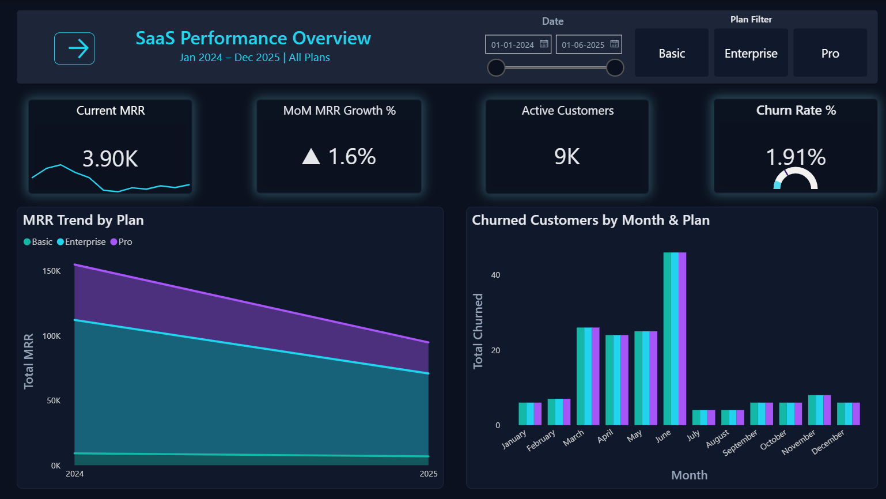
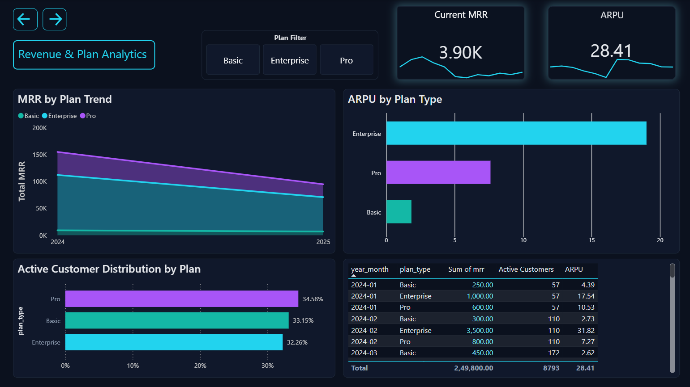
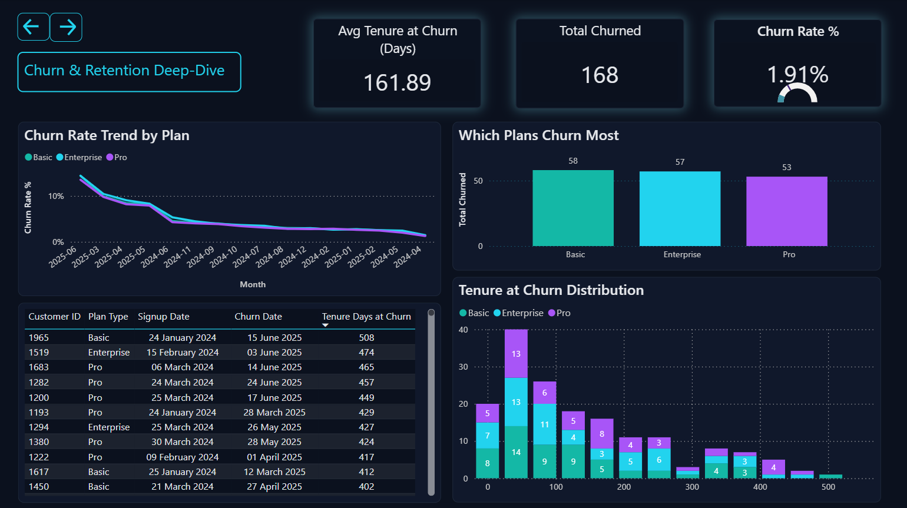
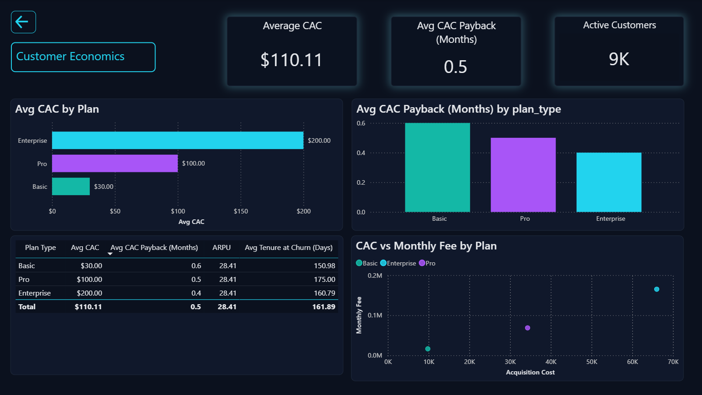

# SaaS Analytics Data Pipeline

A full end-to-end analytics pipeline for a SaaS business — because spreadsheets are for people who enjoy suffering. It ingests raw CSV data, loads it into a PostgreSQL data warehouse, transforms it into a star-schema model, creates analytical SQL views, and surfaces everything in a Power BI report with four dashboards.

---

## Table of Contents

1. [Project Overview](#project-overview)
2. [Tech Stack](#tech-stack)
3. [Project Structure](#project-structure)
4. [Data Model](#data-model)
   - [Raw Layer](#raw-layer)
   - [Dimension Tables](#dimension-tables)
   - [Fact Tables](#fact-tables)
   - [Analytical Views](#analytical-views)
5. [ETL Pipeline](#etl-pipeline)
   - [Step 1 - Load Raw](#step-1--load-raw)
   - [Step 2 - Transform & Load](#step-2--transform--load)
6. [SQL Analytics Layer](#sql-analytics-layer)
7. [Power BI Report](#power-bi-report)
   - [Semantic Model](#semantic-model)
   - [DAX Measures](#dax-measures)
   - [Report Pages](#report-pages)
8. [Configuration](#configuration)
9. [How to Run](#how-to-run)
10. [Notebooks](#notebooks)

---

## Project Overview

This project implements a **SaaS business analytics platform** built around three core datasets — customers, subscriptions, and revenue. The pipeline follows the classic **ELT pattern**:

1. **Extract** — Read raw CSV files.
2. **Load** — Ingest them directly into a PostgreSQL database as raw tables.
3. **Transform** — Clean and restructure data into a star-schema (dimensions + facts).
4. **Analyse** — SQL views compute business KPIs on top of the star schema.
5. **Visualise** — Power BI connects directly to the views and tables to serve four interactive report pages.

## Skills Demonstrated

- SQL data modeling and analytics (star schema, analytical views for MRR, churn, active customers, unit economics).
- Python ETL pipeline (CSV ingestion, Postgres loads, dimensional modeling with `pandas` and SQLAlchemy).
- Power BI semantic modeling (TMDL tables, relationships, measures) and dashboard design across four SaaS KPI pages.
- Configuration-driven development (`config_dev.yaml` for environment & connections) and reproducible project structure using Git.

### Dashboard Preview

**Page 1 — Executive Overview**



**Page 2 — Revenue & Plan Analytics**



**Page 3 — Churn & Retention Deep-Dive**



**Page 4 — Customer Economics**



---

## Tech Stack

| Layer | Technology |
|---|---|
| **Language** | Python 3 |
| **Data Processing** | pandas |
| **Database** | PostgreSQL |
| **DB Connection** | SQLAlchemy |
| **Config Management** | PyYAML |
| **Analytical Views** | SQL (PostgreSQL dialect) |
| **Visualisation** | Power BI (`.pbip` format / PBIR) |
| **Semantic Model Format** | TMDL (Tabular Model Definition Language) |
| **Notebooks** | Jupyter Notebook |
| **Version Control** | Git |

---

## Project Structure

```
project_root/
|
+-- README.md                        <- You are here
+-- .gitignore                       <- Excludes logs/, __pycache__/, *.pyc, .pbi/
|
+-- config/
|   +-- config_dev.yaml              <- DB credentials and data path config (dev env)
|
+-- data/
|   +-- raw/                         <- Source CSV files (input to the pipeline)
|   |   +-- customers.csv
|   |   +-- subscriptions.csv
|   |   +-- revenue.csv
|   +-- processed/                   <- Intended for transformed exports (currently unused)
|       +-- README.md
|
+-- src/                             <- Python ETL scripts
|   +-- db.py                        <- DB connection factory + config loader
|   +-- load_raw.py                  <- Stage 1: loads raw CSVs into Postgres
|   +-- transform_pipeline.py        <- Stage 2: builds and loads star-schema tables
|
+-- sql/                             <- Analytical SQL views
|   +-- analytics_views.sql          <- Monthly churn by plan + Monthly MRR by plan
|   +-- analytics_views1.sql         <- Monthly active customers + Customer economics
|
+-- notebooks/
|   +-- 01_eda.ipynb                 <- Exploratory Data Analysis notebook
|
+-- logs/                            <- Runtime logs (git-ignored)
|
+-- Saas_Analytics.pbip              <- Power BI project entry point
+-- Saas_Analytics.Report/           <- Power BI report layer (PBIR format)
|   +-- definition/
|       +-- report.json
|       +-- version.json
|       +-- pages/                   <- One subdirectory per report page
|           +-- c5b543a3c17ad6fb3c1c/  -> Executive Overview
|           +-- 5f47933a3c5988a6f969/  -> Revenue & Plan Analytics
|           +-- 9e2432b37e149c8163e7/  -> Churn & Retention Deep-Dive
|           +-- b0d89724a4eeba3af820/  -> Customer Economics
|
+-- Saas_Analytics.SemanticModel/    <- Power BI semantic model (TMDL format)
    +-- definition/
        +-- model.tmdl               <- Model-level settings and table references
        +-- relationships.tmdl       <- All table relationships
        +-- database.tmdl
        +-- diagramLayout.json
        +-- cultures/
        +-- tables/                  <- One TMDL file per table / view
            +-- _Measures.tmdl       <- All DAX measures
            +-- dim_customer.tmdl
            +-- dim_date.tmdl
            +-- fact_revenue.tmdl
            +-- fact_subscription.tmdl
            +-- vw_monthly_mrr_by_plan.tmdl
            +-- vw_monthly_churn_by_plan.tmdl
            +-- vw_monthly_active_customers.tmdl
            +-- vw_customer_economics.tmdl
```

---

## Data Model

### Raw Layer

Three source CSV files land in `data/raw/` and are loaded as-is into PostgreSQL by `load_raw.py`:

| Raw Table | Source File | Description |
|---|---|---|
| `customers_raw` | `customers.csv` | Customer signup, plan, fee, acquisition cost, churn info |
| `subscriptions_raw` | `subscriptions.csv` | Monthly subscription records per customer |
| `revenue_raw` | `revenue.csv` | Monthly revenue entries by type and amount |

### Dimension Tables

Dimensions are built from the raw data and act as lookup/reference tables for the facts.

| Table | Key Column | Description |
|---|---|---|
| `dim_customer` | `customer_key` (surrogate) | Cleaned customer data: plan type, fees, signup/churn dates, `is_churned` flag |
| `dim_date` | `date_key` (YYYYMMDD int) | Date dimension derived from subscription months; includes year, month, day, year_month |

### Fact Tables

| Table | Grain | Foreign Keys | Key Metrics |
|---|---|---|---|
| `fact_subscription` | One row per customer per month | `customer_key`, `month_key` | `monthly_fee` |
| `fact_revenue` | One row per revenue event per customer per month | `customer_key`, `month_key` | `amount`, `revenue_type` |

### Analytical Views

Four PostgreSQL views computed on top of the star schema:

| View | Description |
|---|---|
| `vw_monthly_mrr_by_plan` | Monthly Recurring Revenue (MRR) aggregated by plan type and month |
| `vw_monthly_churn_by_plan` | Count of churned customers per plan type per month |
| `vw_monthly_active_customers` | Active customer count per plan type per month |
| `vw_customer_economics` | Per-customer economics: CAC payback months and tenure at churn |

---

## ETL Pipeline

### Step 1 - Load Raw

**Script:** `src/load_raw.py`

Reads each CSV file from the path defined in `config_dev.yaml` and writes it to the corresponding `*_raw` table in PostgreSQL using `pandas.DataFrame.to_sql()` with `if_exists="replace"`. This is a full-refresh load.

```
customers.csv       ->  customers_raw
subscriptions.csv   ->  subscriptions_raw
revenue.csv         ->  revenue_raw
```

### Step 2 - Transform & Load

**Script:** `src/transform_pipeline.py`

Orchestrates the full dimensional load in a single `load_dim_and_facts()` function call:

1. **Extract** — Reads the three CSVs into DataFrames.
2. **Build `dim_customer`** — Parses dates, computes the `is_churned` flag, deduplicates, and selects the required columns.
3. **Build `dim_date`** — Derives a date dimension from the unique months in the subscriptions data.
4. **Load dimensions** — Writes `dim_customer` and `dim_date` to PostgreSQL (`if_exists="append"`).
5. **Read back surrogate keys** — Re-reads `customer_key` and `date_key` from the DB to ensure the correct DB-generated keys are used for fact joins.
6. **Build `fact_subscription`** — Merges subscriptions with the dimension keys.
7. **Build `fact_revenue`** — Merges revenue with the dimension keys.
8. **Load facts** — Writes both fact tables to PostgreSQL.

---

## SQL Analytics Layer

**Files:** `sql/analytics_views.sql` and `sql/analytics_views1.sql`

These scripts must be run against the `saas_analytics` PostgreSQL database **after** the ETL pipeline completes. They create four `CREATE OR REPLACE VIEW` objects that Power BI then queries directly.

**`analytics_views.sql`**
- `vw_monthly_churn_by_plan` — joins `dim_customer` to `dim_date` using a date-range condition on `churn_date`.
- `vw_monthly_mrr_by_plan` — joins `fact_revenue` to `dim_customer` to `dim_date` and sums `amount`.

**`analytics_views1.sql`**
- `vw_monthly_active_customers` — counts customers whose `signup_date` is before the end of a given month and who have not yet churned.
- `vw_customer_economics` — computes `cac_payback_months` (`acquisition_cost / monthly_fee`) and `tenure_days_at_churn` per customer.

---

## Power BI Report

The report is stored in the Power BI enhanced format (`.pbip`) and checked into Git as plain text TMDL/JSON files. Power BI Desktop (with PBIR preview enabled) or Fabric can open this project directly.

### Semantic Model

**Location:** `Saas_Analytics.SemanticModel/`

The model connects directly to the `saas_analytics` PostgreSQL database and imports the following tables and views:

- `dim_customer`, `dim_date`
- `fact_revenue`, `fact_subscription`
- `vw_monthly_mrr_by_plan`, `vw_monthly_churn_by_plan`
- `vw_monthly_active_customers`, `vw_customer_economics`

**Relationships defined in `relationships.tmdl`:**

| From | To | Type |
|---|---|---|
| `fact_subscription.customer_key` | `dim_customer.customer_key` | Many-to-one |
| `fact_subscription.month_key` | `dim_date.date_key` | Many-to-one |
| `fact_revenue.month` | Local date table | Date-part only |
| `vw_monthly_churn_by_plan.year_month` | `dim_date.year_month` | Many-to-one |
| `vw_monthly_mrr_by_plan.year_month` | `dim_date.year_month` | Many-to-one |
| `vw_monthly_active_customers.year_month` | `dim_date.year_month` | Many-to-one |

### DAX Measures

All measures live in the dedicated `_Measures` table (`tables/_Measures.tmdl`):

| Measure | Description |
|---|---|
| `Total MRR` | Sum of MRR across all months and plans |
| `Current MRR` | MRR filtered to the most recent date in `dim_date` |
| `Prior Month MRR` | MRR shifted back one month via `DATEADD` |
| `MoM MRR Growth %` | Month-over-month growth: `(Total MRR - Prior Month MRR) / Prior Month MRR` |
| `MoM Growth Indicator` | Text label: up-arrow or down-arrow with formatted percentage |
| `Active Customers` | Sum of active customer count from the active customers view |
| `Total Active Customers` | `Active Customers` with plan-type filter removed (used for `Plan Mix %`) |
| `Total Churned` | Sum of churned customers |
| `Churn Rate %` | `Total Churned / Active Customers` |
| `ARPU` | Average Revenue Per User: `Total MRR / Active Customers` |
| `Plan Mix %` | Share of active customers per plan: `Active Customers / Total Active Customers` |
| `Avg CAC` | Average customer acquisition cost |
| `Avg CAC Payback (Months)` | Average months to recover acquisition cost |
| `Avg Tenure at Churn (Days)` | Average days a churned customer was active before leaving |
| `Churn Target %` | Hard-coded benchmark: 5% |

### Report Pages

The report contains **four pages**, all styled with a dark background (`#0B111E`).

---

#### Page 1 — Executive Overview

Top-level KPIs at a glance: Total MRR, Active Customers, Churn Rate, and ARPU. Designed as the landing page for stakeholders who want the headline numbers without digging through the details.

---

#### Page 2 — Revenue & Plan Analytics

Breaks down MRR trends over time by plan type, shows month-over-month growth (with the `MoM Growth Indicator` arrow label), and visualises plan mix distribution across the customer base.

---

#### Page 3 — Churn & Retention Deep-Dive

Monthly churn counts and churn rate trended over time, segmented by plan type. Includes a reference line for the 5% `Churn Target %` benchmark to quickly flag months where churn exceeded the threshold.

---

#### Page 4 — Customer Economics

Per-customer unit economics: Average CAC, CAC Payback period in months, and average tenure at churn in days. Helps evaluate the long-term profitability and sustainability of each plan segment.

---

## Configuration

**File:** `config/config_dev.yaml`

```yaml
db:
  dialect: postgresql
  host: localhost
  port: 5432
  database: saas_analytics
  user: postgres
  password: <your_password>   # Do not commit real credentials

paths:
  raw_data: data/raw
  processed_data: data/processed
```

> **Warning:** `config_dev.yaml` currently stores a plaintext password. Before pushing to any remote repository, replace credentials with environment variables or a secrets manager.

---

## How to Run

### Prerequisites

- Python 3.8+
- PostgreSQL running locally with a database named `saas_analytics`
- Required Python packages:

```bash
pip install pandas sqlalchemy psycopg2-binary pyyaml
```

### Execution Order

```bash
# 1. Update credentials in config/config_dev.yaml

# 2. Load raw CSVs into Postgres
cd src
python load_raw.py

# 3. Build the star schema (dimensions + facts)
python transform_pipeline.py

# 4. Apply the analytical views (run once in psql or any SQL client)
psql -d saas_analytics -f ../sql/analytics_views.sql
psql -d saas_analytics -f ../sql/analytics_views1.sql

# 5. Open Saas_Analytics.pbip in Power BI Desktop and refresh
```

---

## Notebooks

| Notebook | Description |
|---|---|
| `notebooks/01_eda.ipynb` | Exploratory Data Analysis — initial data profiling of the raw CSVs before pipeline design |
